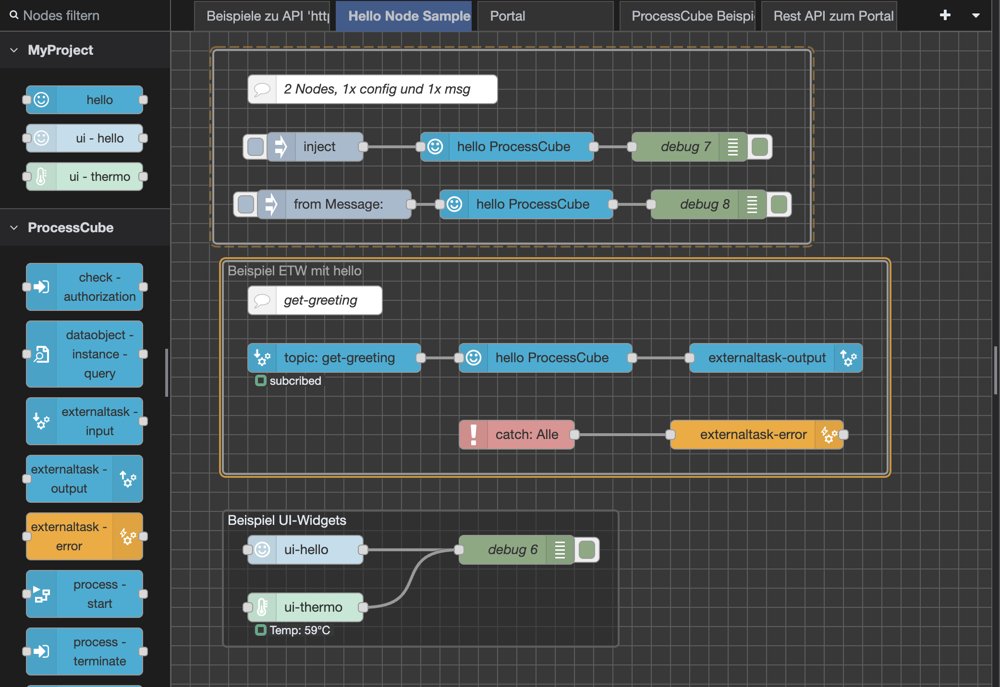
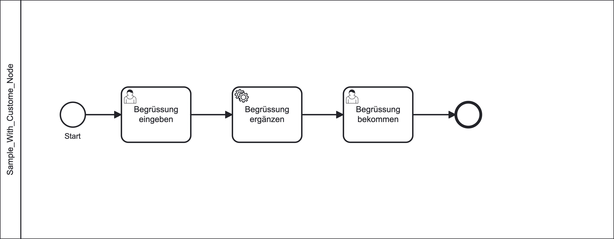

# ProcessCube.AppTemplate

Dieses Template demonstriert die Entwicklung und das Debugging von Custom-Komponenten für ProcessCube LowCode Apps.

## Übersicht

Das Template zeigt folgende Konzepte:

- **Custom-Plugin**: `apps/lowcode/src/nodes/aplugin/*`
- **Custom-Node-RED-Node**: `apps/lowcode/src/nodes/sample_node/*`
- **UI-Node für das Dashboard-2**:
   - `/apps/lowcode/src/nodes/ui-hello.js` / `/apps/lowcode/src/nodes/ui-hello.html`
   - `/apps/lowcode/src/nodes/ui-termo.js` / `/apps/lowcode/src/nodes/ui-termo.html`

und die Vue.js-Dateien für die UI-Komponenten:
- `/apps/lowcode/src/ui/componentes/ui-hello.vue`
- `/apps/lowcode/src/ui/componentes/ui-termo.vue`

WICHITG: Das Paket für die UI-Widgets muss mit dem Package-Name `node-red-dashboard-2-` beginnen und im nodesDir der Node-RED-Installation (`RED.settings...userDir`) liegen, damit es korrekt geladen wird.

Siehe dazu auch die [Dashboard-2-Dokumentation](https://dashboard.flowfuse.com/contributing/widgets/third-party#naming-your-widget).

## Custom-Nodes und External Tasks

Diese Beispiele zeigen die Entwicklung von Custom-Plugins und -Nodes mittels JavaScript, die in LowCode Apps verwendet werden können.

Um das Einbinden von Custom-Komponenten zu demonstrieren, haben wir einen Beispiel-Node erstellt, der über External Tasks in Node-RED mit der ProcessCube Engine integriert wird.

### Beispiel-Node

Der Beispiel-Node ist ein einfacher Node, der eine konfigurierbare Begrüßung ausgibt und in Node-RED wie folgt verwendet wird:

Der zugehörige Prozess mit External Task in der Engine:

## Debugging

### Optionen für das Debugging:

- **Attach to Node-RED**: [Docker-Compose Konfiguration](https://github.com/5minds/ProcessCube.AppTemplate/blob/main/docker-compose.yml#L72)
- **Breakpoint beim Start**: Node-RED pausiert beim Start bis der Debugger verbunden ist ([Konfiguration](https://github.com/5minds/ProcessCube.AppTemplate/blob/main/docker-compose.yml#L75))

### Debugging-Schritte:

1. Container starten
2. In VSCode: **Run and Debug** → **Attach to Node-RED**
3. Breakpoints setzen und debuggen

## Enthaltene Komponenten

- **ProcessCube Engine** mit PostgreSQL-Anbindung
- **ProcessCube Authority**
- **PostgreSQL** mit Initialisierungsskript und dynamischem externen Port-Mapping

## Roadmap

- [x] JavaScript Version
- [x] npm-Packages im Docker-Image installieren
- [x] Plugin für Node-RED
- [x] Beispiel-Node für Node-RED
- [x] Debugging mit VSCode
- [x] GitHub Actions Workflow und Docker-Image
- [ ] TypeScript Version
