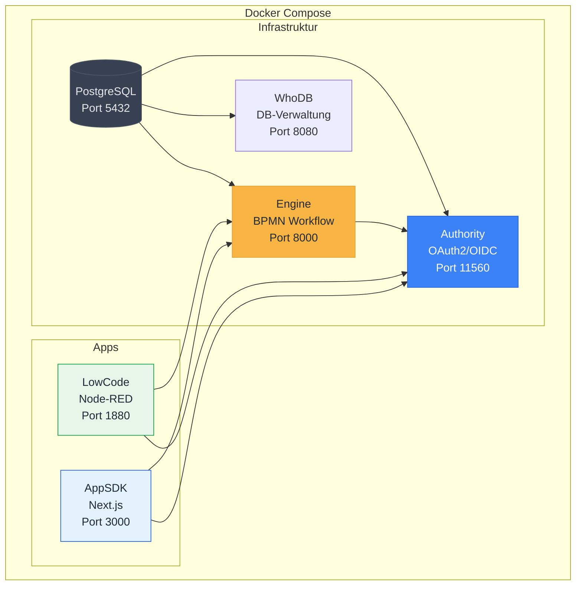
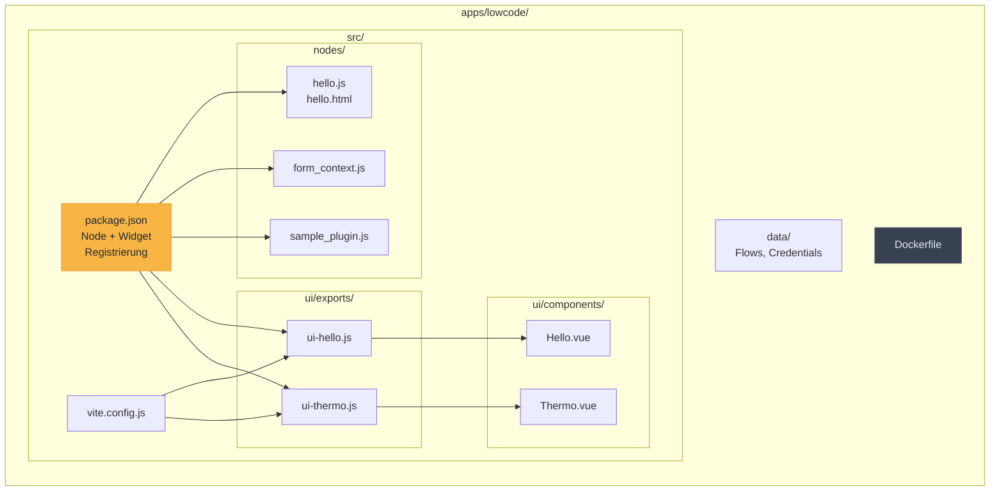
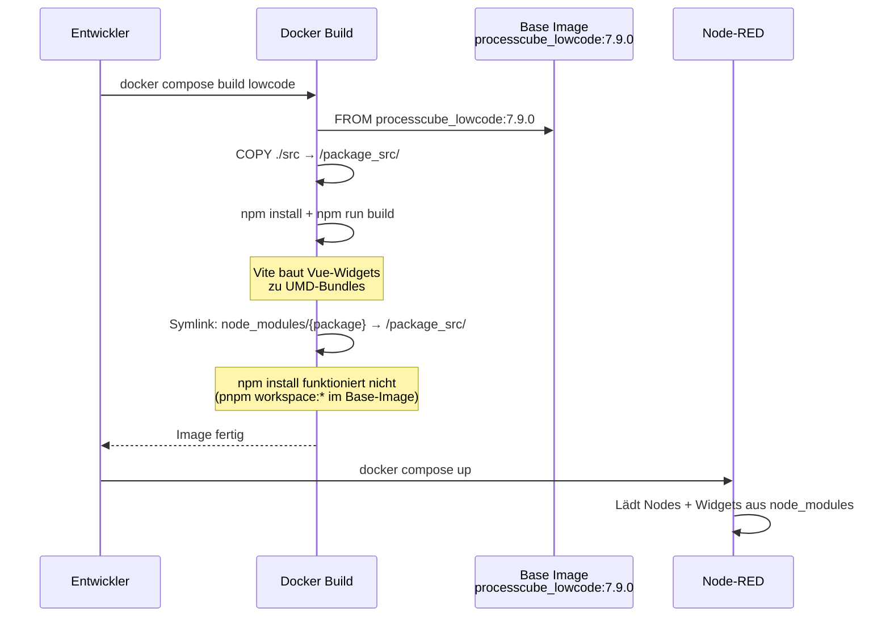
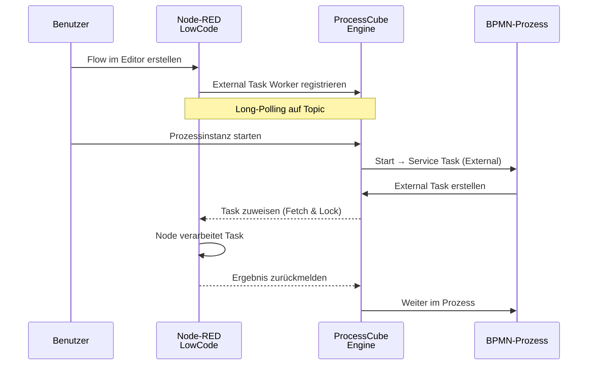
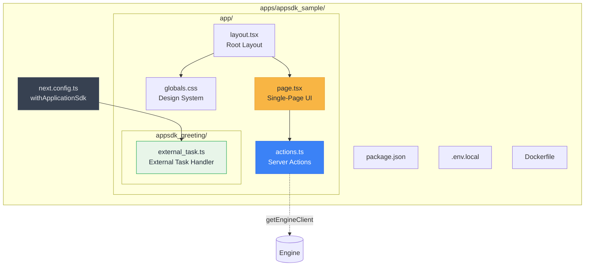
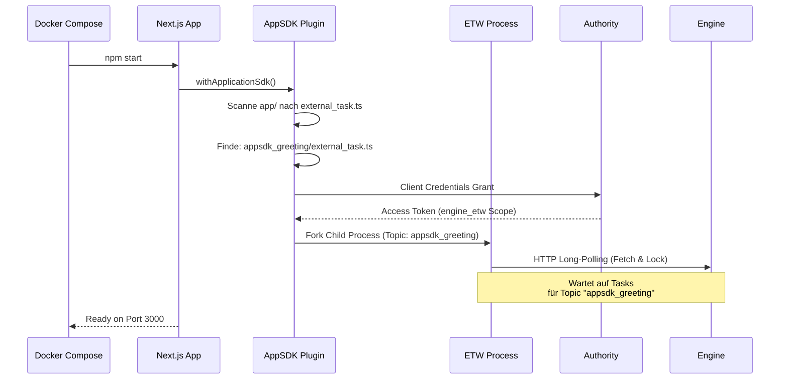
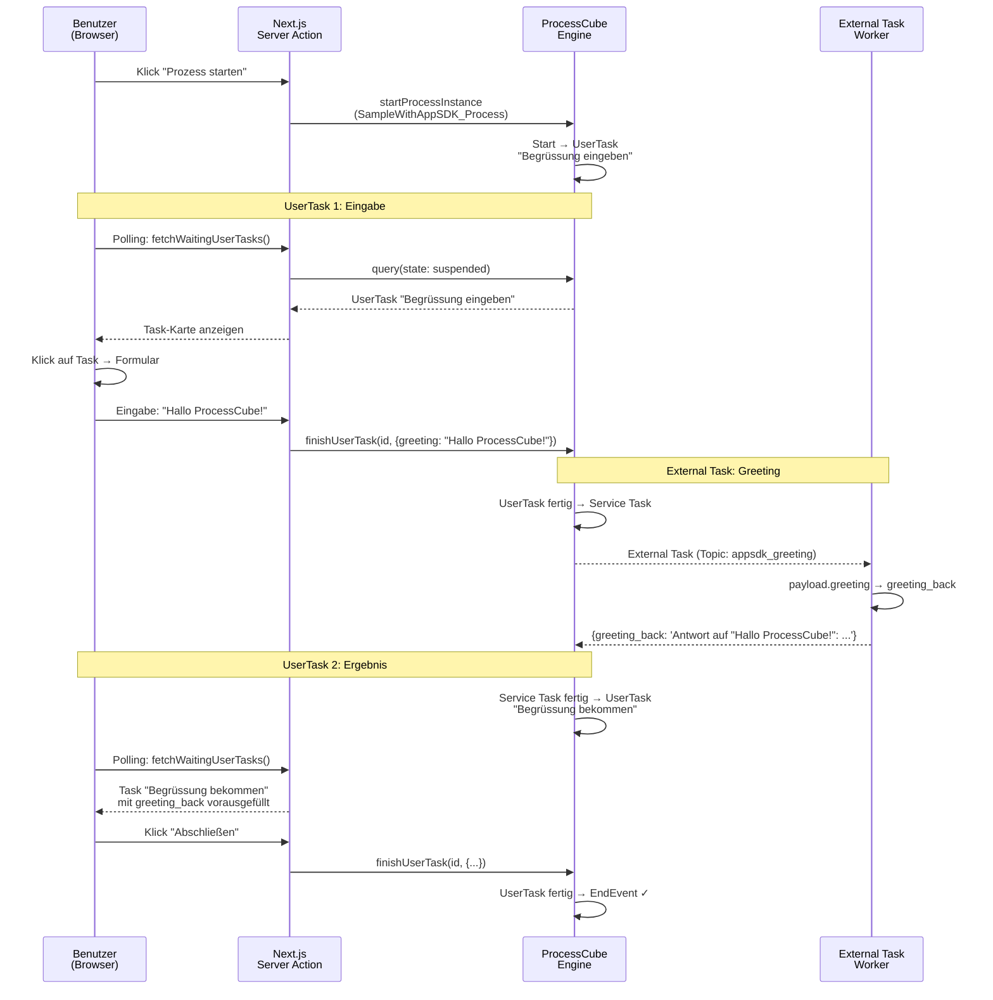
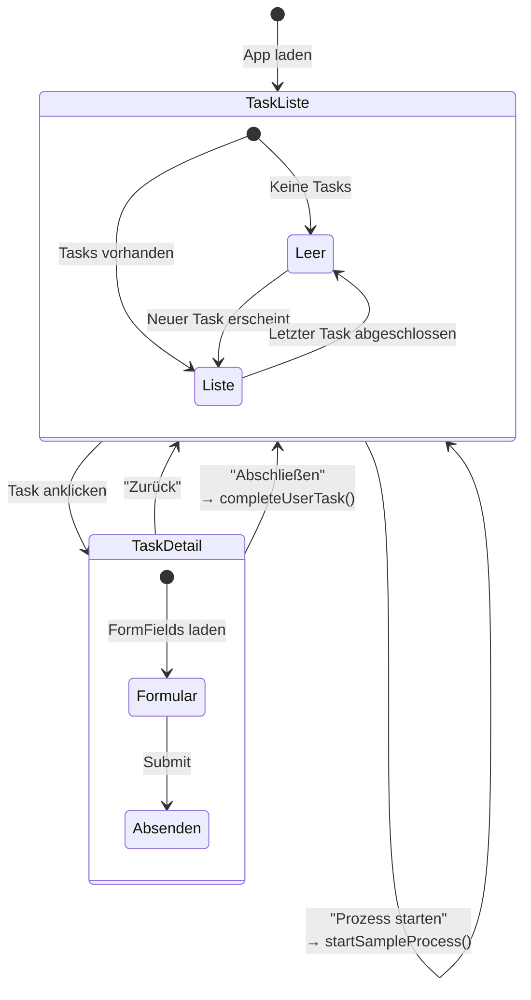
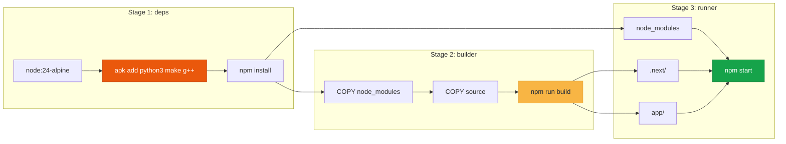
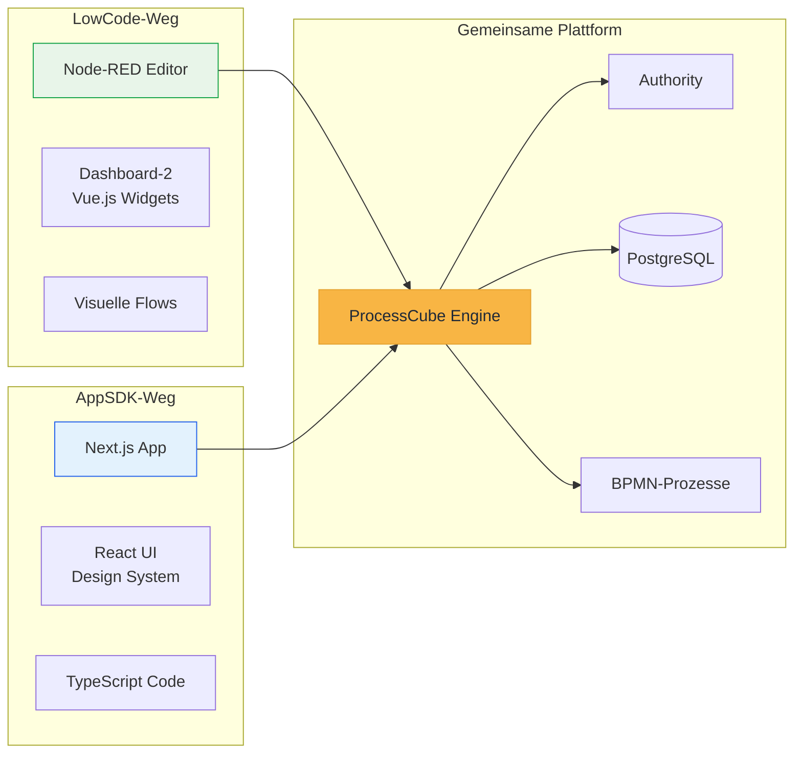

# Apps im ProcessCube.AppTemplate

Dieses Dokument beschreibt die zwei App-Typen, die im ProcessCube.AppTemplate erstellt werden können: **LowCode** (Node-RED) und **AppSDK** (Next.js).

---

## Plattform-Architektur

Beide App-Typen nutzen dieselbe Infrastruktur:



### Dienste

| Dienst | Image | Port | Funktion |
|--------|-------|------|----------|
| **postgres** | `processcube.postgres:0.2.1` | 5432 | PostgreSQL 18, erstellt automatisch `engine`, `authority`, `appdb` |
| **engine** | `processcube_engine:20.1.1` | 8000 | BPMN-Workflow-Engine, verwaltet Prozesse und Tasks |
| **authority** | `processcube_authority:3.5.2` | 11560 | OAuth2/OIDC Identity Provider |
| **whodb** | `clidey/whodb:latest` | 8080 | Web-basierte Datenbankverwaltung |

---

## LowCode-App (Node-RED)

### Überblick

Die LowCode-App basiert auf **Node-RED** und ermöglicht die visuelle Programmierung von Workflows. Custom Nodes und Dashboard-Widgets werden als npm-Pakete entwickelt und in das Node-RED-Image integriert.

### Installation

```bash
# 1. Repository klonen
git clone https://github.com/5minds/ProcessCube.AppTemplate.git
cd ProcessCube.AppTemplate

# 2. Abhängigkeiten installieren (im src-Verzeichnis)
cd apps/lowcode/src
npm install

# 3. Widgets bauen
npm run build

# 4. Docker-Image bauen und starten
cd ../../..
docker compose build lowcode
docker compose up -d
```

Node-RED ist erreichbar unter: **http://localhost:1880**

### Aufbau



#### Verzeichnisstruktur

```
apps/lowcode/
├── src/
│   ├── nodes/                    # Node-RED Node-Implementierungen
│   │   ├── sample_node/
│   │   │   ├── hello.js          # Backend: External Task Worker
│   │   │   └── hello.html        # Editor: Node-Konfiguration
│   │   ├── form_context/
│   │   │   └── form_context.js   # Formular-Kontext-Node
│   │   └── aplugin/
│   │       └── sample_plugin.js  # Plugin mit HTTP-Endpunkt
│   ├── ui/
│   │   ├── components/           # Vue.js Dashboard-Widgets
│   │   │   ├── Hello.vue         # Hello-World Widget
│   │   │   └── Thermo.vue        # Thermometer Widget
│   │   └── exports/              # Vite Build-Einträge
│   │       ├── ui-hello.js
│   │       └── ui-thermo.js
│   ├── package.json              # Node/Widget-Registrierung + Scripts
│   ├── vite.config.js            # Build-Konfiguration
│   └── custom_settings.js        # Node-RED Einstellungen
├── data/                         # Persistente Node-RED-Daten
└── Dockerfile                    # Basiert auf processcube_lowcode
```

#### Komponentenarten

| Typ | Verzeichnis | Beschreibung |
|-----|-------------|-------------|
| **Custom Node** | `nodes/` | JS-Backend + HTML-Editor, integriert mit Engine via External Tasks |
| **Dashboard Widget** | `ui/components/` | Vue.js SFC, kommuniziert via Socket.io |
| **Plugin** | `nodes/` | Stellt HTTP-Endpunkte bereit (z.B. REST API) |

### Ablauf

#### Dockerfile-Build



#### External Task Integration



### Debugging

1. `docker compose up` starten
2. VSCode: **Ausführen und Debuggen → "Attach to Node-RED"** (Port 9229)
3. Breakpoints in `apps/lowcode/src/` setzen

Für Break-on-Start: `NODE_OPTIONS=--inspect-brk=0.0.0.0:9229` in der docker-compose einkommentieren.

---

## AppSDK-App (Next.js)

### Überblick

Die AppSDK-App basiert auf **Next.js 15** mit dem **ProcessCube App SDK**. Sie bietet eine moderne Web-Oberfläche für BPMN-Prozesse mit automatischem External Task Worker Management und UserTask-Formularen.

### Installation

```bash
# 1. Repository klonen (falls noch nicht geschehen)
git clone https://github.com/5minds/ProcessCube.AppTemplate.git
cd ProcessCube.AppTemplate

# 2. Abhängigkeiten installieren
cd apps/appsdk_sample
npm install

# 3. App bauen
npm run build

# 4. Docker-Image bauen und starten
cd ../..
docker compose build appsdk_sample
docker compose up -d
```

Die App ist erreichbar unter: **http://localhost:3000** (oder `APPSDK_SAMPLE_PORT`)

### Aufbau



#### Verzeichnisstruktur

```
apps/appsdk_sample/
├── app/
│   ├── globals.css                  # ProcessCube Studio Design System
│   ├── layout.tsx                   # Root Layout (importiert CSS)
│   ├── page.tsx                     # Single-Page App (Menü + Tasks + Formular)
│   ├── actions.ts                   # Server Actions (Engine-Kommunikation)
│   ├── tasks/                       # (Legacy-Seite, kann entfernt werden)
│   │   ├── page.tsx
│   │   └── task-list.tsx
│   ├── usertask/[id]/               # (Legacy-Seite, kann entfernt werden)
│   │   └── page.tsx
│   └── appsdk_greeting/
│       └── external_task.ts         # External Task Handler (Topic: appsdk_greeting)
├── public/                          # Statische Assets
├── .env.local                       # Umgebungsvariablen (Docker-Netzwerk)
├── .env.local.example               # Vorlage für Umgebungsvariablen
├── .dockerignore                    # Excludes: node_modules, .next, .env.local
├── Dockerfile                       # Multi-Stage Build (deps → builder → runner)
├── next.config.ts                   # AppSDK Plugin + esbuild
├── package.json                     # Next.js 15 + AppSDK + React 19
└── tsconfig.json                    # TypeScript (ES2024, bundler)
```

#### Schlüsselkomponenten

| Datei | Funktion |
|-------|----------|
| **next.config.ts** | `withApplicationSdk()` aktiviert External Task Worker, `serverExternalPackages: ['esbuild']` |
| **actions.ts** | Server Actions nutzen `getEngineClient()` für Prozess-Start, Task-Abfrage, Task-Abschluss |
| **page.tsx** | Client Component mit Polling (3s), Menü, Task-Liste, UserTask-Formular |
| **external_task.ts** | Handler-Funktion, Verzeichnisname = BPMN-Topic |
| **globals.css** | ProcessCube Studio Design System (Gold-Akzent, System-Fonts, CSS Variables) |

### Ablauf

#### App-Startup und Worker-Registrierung



#### Prozess-Durchlauf (Greeting-Beispiel)



#### UI-Architektur (Single-Page)



### Dockerfile-Build



**Hinweis**: `python3`, `make` und `g++` werden nur im `deps`-Stage benötigt (für native Module wie `utf-8-validate` via node-gyp). Das finale Runner-Image enthält sie nicht.

---

## Vergleich der App-Typen

| Aspekt | LowCode (Node-RED) | AppSDK (Next.js) |
|--------|--------------------|--------------------|
| **Zielgruppe** | Citizen Developer, Low-Code | Professionelle Entwickler |
| **UI-Erstellung** | Visueller Flow-Editor + Dashboard-2 | React/TypeScript Code |
| **External Tasks** | Node-RED Nodes (JS) | Datei-basiert (`external_task.ts`) |
| **UserTasks** | Dashboard-2 Widgets (Vue.js) | Server Actions + React Forms |
| **Deployment** | Docker (processcube_lowcode Base) | Docker (node:24-alpine) |
| **Hot-Reload** | Node-RED Editor | AppSDK Datei-Watcher |
| **Debugging** | VSCode Attach (Port 9229) | Standard Next.js Dev Tools |
| **Styling** | Dashboard-2 Theme | ProcessCube Studio Design System |



---

## Schnellstart

### Nur Infrastruktur starten

```bash
docker compose up -d postgres engine authority whodb
```

### Mit LowCode-App

```bash
docker compose up -d
# → Node-RED: http://localhost:1880
```

### Mit AppSDK-App

```bash
APPSDK_SAMPLE_PORT=3000 docker compose up -d
# → AppSDK: http://localhost:3000
```

### Alles zusammen

```bash
APPSDK_SAMPLE_PORT=3003 docker compose up -d
# → Node-RED:  http://localhost:1880
# → AppSDK:    http://localhost:3003
# → Engine:    http://localhost:8000
# → Authority: http://localhost:11560
# → WhoDB:     http://localhost:8080
```
